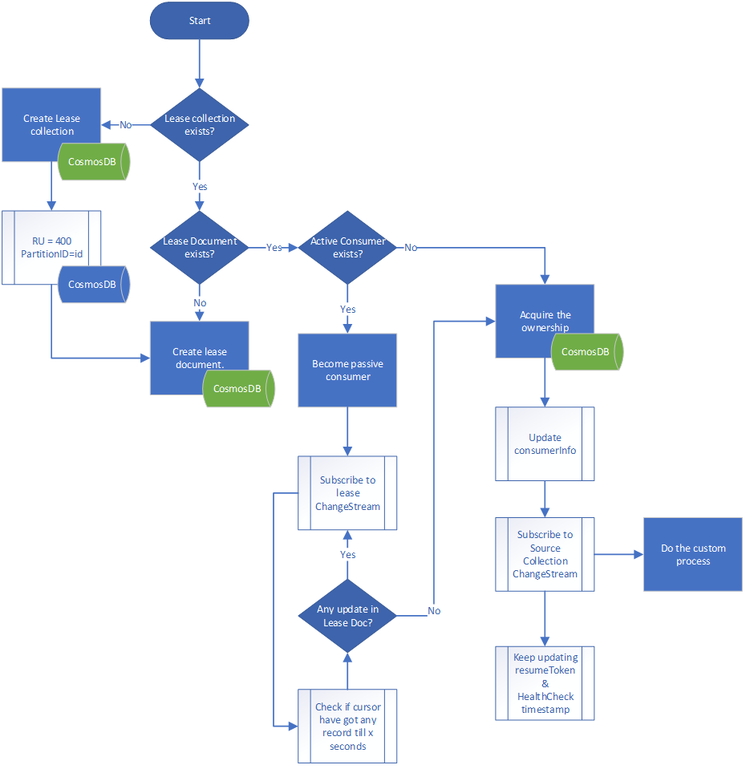

Cosmos DB - Mongo API in v3.6 has support for ChangeStream and this sample will help you to use it in Java.

## Contents

| File/folder       | Description                                |
|-------------------|--------------------------------------------|
| `src`             | Sample source code.                        |
| `.gitignore`      | Define what to ignore at commit time.      |
| `CHANGELOG.md`    | List of changes to the sample.             |
| `CONTRIBUTING.md` | Guidelines for contributing to the sample. |
| `README.md`       | This README file.                          |
| `LICENSE`         | The license for the sample.                |

## Prerequisites

- Access to Cosmos DB - Mongo API / Emulator is also supported
- Java

## Introduction
This is a sample written in JAVA to demonstrate Azure Cosmos DB - Mongo API's ChangeStream functionality.

## WithLease Flag
There is configuration file in this sample at mongostream/src/main/java/com/azure/cosmos/mongostream/config.properties in which there is a property called "withlease" by default it is having yes flag.
Please mention no, if you are not looking for high availability in the consumer process.

## Lease Requirement
Azure Cosmos DB - Mongo API’s ChangeStream is a great way to keep a tap on changes in source collection.
If you would like to do run the consumer in High Availability mode to make consumer to make it durable.
This is not available Out-Of-The-Box OOTB hence custom code is needed.

## The Solution

* This sample will demonstrate, how to run more than one copy of the same consumer.
* There should be a Master/Slave model for consumers and only one copy of consumer must be consuming the feed from source collection.
* The consumer must maintain the state in database such that slave can keep monitoring.
* Slave can become master as soon as it finds master stops updating the healthcheck.

## Process Flow explanation of the lease logic

## Contributing

This project welcomes contributions and suggestions.  Most contributions require you to agree to a
Contributor License Agreement (CLA) declaring that you have the right to, and actually do, grant us
the rights to use your contribution. For details, visit https://cla.opensource.microsoft.com.

When you submit a pull request, a CLA bot will automatically determine whether you need to provide
a CLA and decorate the PR appropriately (e.g., status check, comment). Simply follow the instructions
provided by the bot. You will only need to do this once across all repos using our CLA.

This project has adopted the [Microsoft Open Source Code of Conduct](https://opensource.microsoft.com/codeofconduct/).
For more information see the [Code of Conduct FAQ](https://opensource.microsoft.com/codeofconduct/faq/) or
contact [opencode@microsoft.com](mailto:opencode@microsoft.com) with any additional questions or comments.
